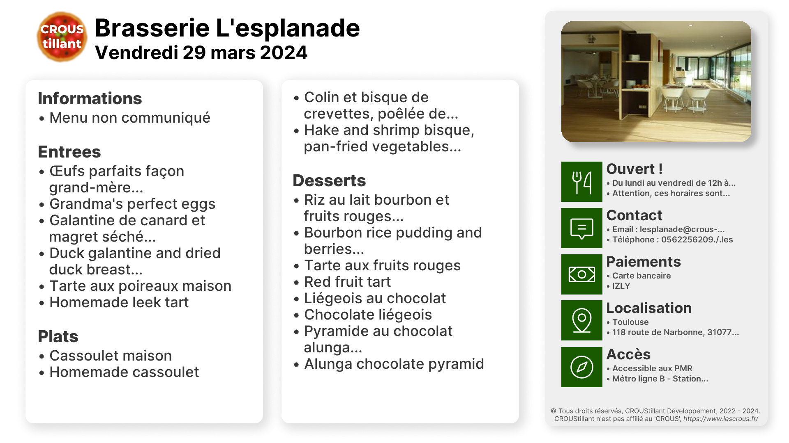

  
# CROUStillant
CROUStillant est un projet qui a pour but de fournir les menus des restaurants universitaires en France et en Outre-Mer. 

  
# 📖 • Sommaire

- [🚀 • Présentation](#--présentation)
    - [📜 • Description](#--description)
    - [📦 • Mais pourquoi CROUStillant ?](#--mais-pourquoi-croustillant-)
    - [📚 • Comment ça marche ?](#--comment-ça-marche-)
- [📃 • Crédits](#--crédits)

# 🚀 • Présentation

## 📜 • Description

CROUStillant est un projet qui a pour but de fournir les menus des restaurants universitaires en France et en Outre-Mer.  

Ce projet était à la base dédié uniquement aux restaurants universitaires sur Reims mais a été étendu à toute la France et les Outre-Mer.  

## 📦 • Mais pourquoi CROUStillant ?

CROUStillant est là pour répondre à un besoin important des étudiants : Que manger à midi ?  

Beaucoup de restaurant universitaires sont séparés en plusieurs restaurants et c'est très pénible d'attendre 30 minutes ou plus pour voir que le menu ne nous convient pas.  

## 📚 • Comment ça marche ?

CROUStillant récupère les menus des restaurants universitaires en France et en Outre-Mer, stocke les données puis les rend accessibles via une API et un BOT Discord.

# 📃 • Crédits

Ce projet est le fruit d'une collaboration entre plusieurs étudiants de l'Université de Reims Champagne-Ardenne :
- [Paul Bayfield](https://github.com/PaulBayfield) - Fondateur du projet et développeur principal
- [Lucas Debeve](https://github.com/lucasDebeve) - Pro de la conception des bases de données, à l'origine de la base de données de CROUStillant
